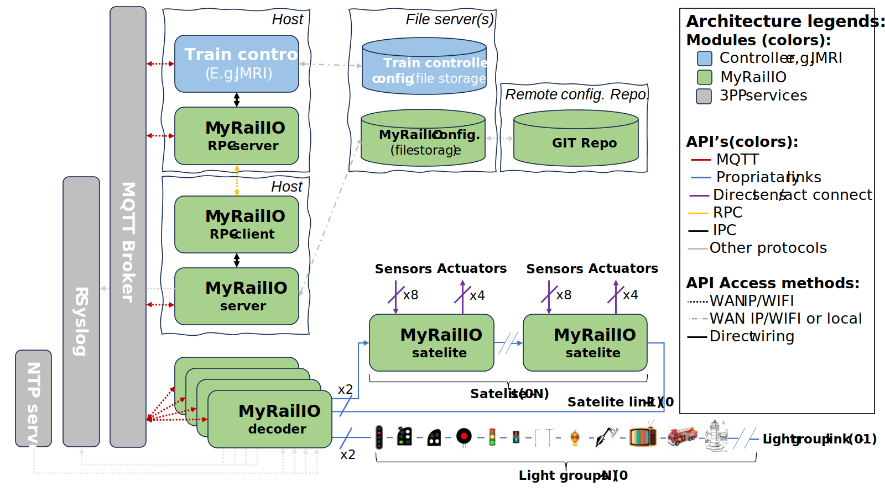
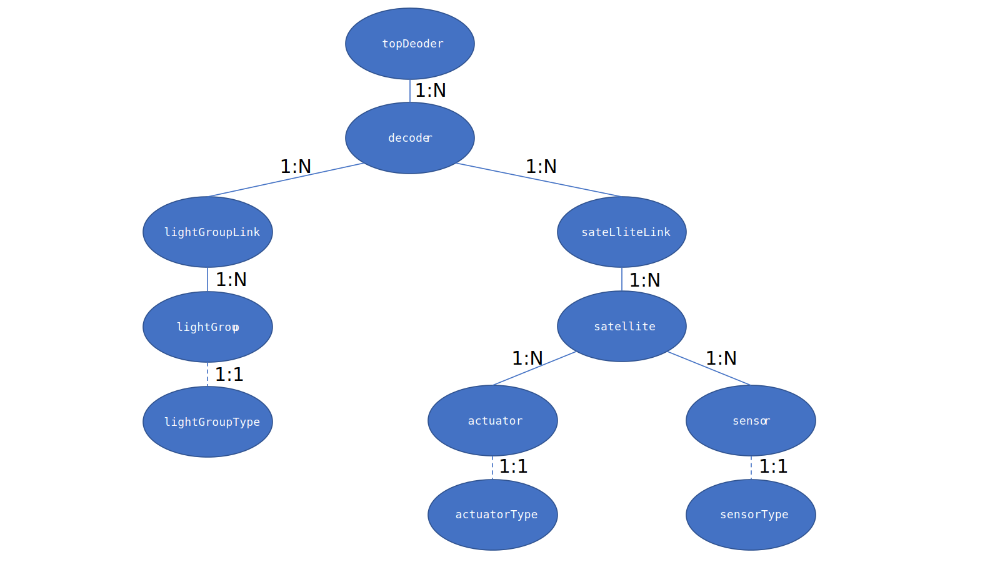
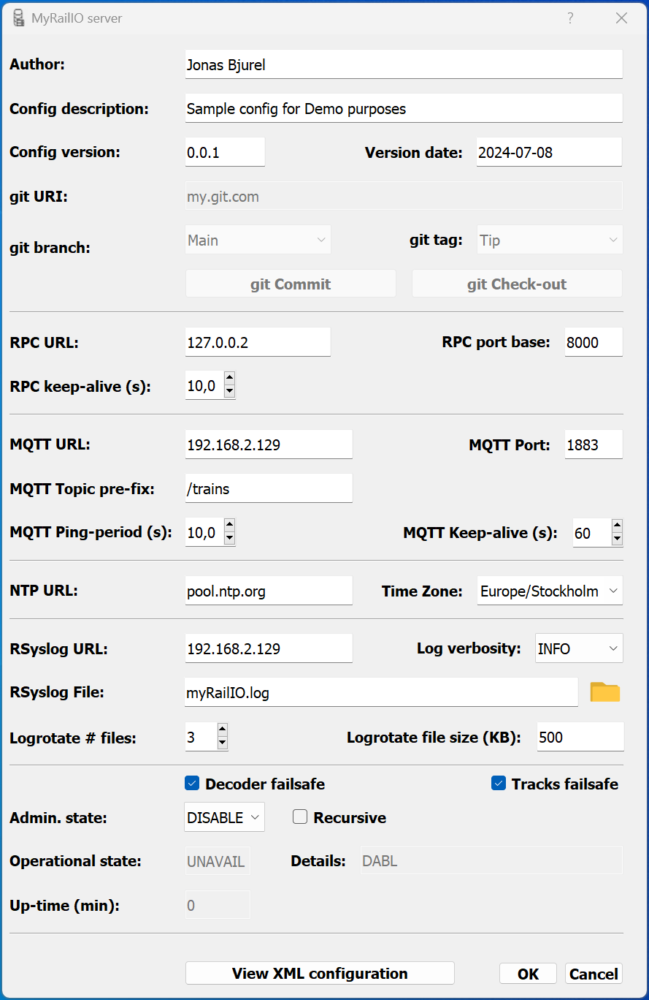
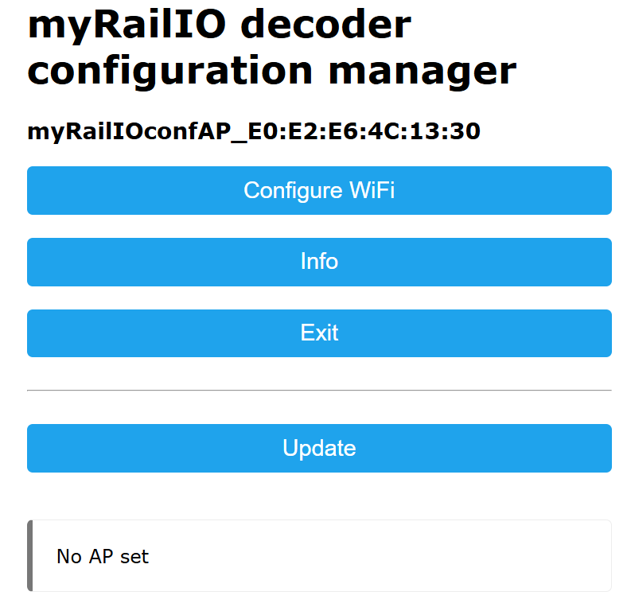

  -----------------------------------------------------------------------
  MyRailIO
  -----------------------------------------------------------------------
  User guide

  Version: 0.0.1
  -----------------------------------------------------------------------

+-----------------------------------------------------------------------+
| Jonas Bjurel                                                          |
|                                                                       |
| 7-6-2024                                                              |
+=======================================================================+
+-----------------------------------------------------------------------+

©

MyRailIO^©^ User guide

A model railway controller backend for signal masts-, sensors-, light
effects-, actuators and more.

# License and copyright

This document is licensed under the Creative Commons
Attribution-NonCommercial-ShareAlike 4.0 International License (CC
BY-NC-SA 4.0). This means that you are free to copy and redistribute the
material in any medium or format, and remix, transform, and build upon
the material, as long as you give appropriate credit to the original
author, use the material for non-commercial purposes only, and
distribute your modifications under the same license as the original.

MyRailIO^©^ is a trademark of Jonas Bjurel. All rights reserved. The
MyRailIO logo is a copy right design of Jonas Bjurel and may not be used
outside of the MyRailIO project without permission.

# Introduction

MyRailIO (maɪreɪlio) provides an Input/Output peripheral backend to
model railway controllers such as JMRI, RockRail, etc. (at current only
JMRI is supported).

MyRailIO provides flexible and configurable capabilities for the model
railway controller to throughout the layout capture various types of
sensors-, control multiple types of signaling masts-, control various
types of light-effects-, and maneuver actuators such as turnouts-,
servos-, and solenoids.

The myRailIO decoders run on multiple cheap ESP32 micro controllers,
each connected to multiple cheap I/O satellite FPGAs; All managed and
supervised by a centralized management software which in principle is OS
independent (currently only tested with Windows 11). The MyRailIO
management software provides a Graphical User Interface for overall
MyRailIO configuration-, status-, alarm-, performance metrics-, and
log/event overview. Apart from a view of the current state of these
metrics, the history of these metrics is stored and can be viewed with
associated time-stamps for later trouble-shooting and debug post-mortem.

The design is entirely open source and licensed under the Apache version
2.0 license (ASLv2), contribution of features-, code-, CI/CD-, testing-,
trouble reporting and bugfixes are highly appreciated. See (XXXX).

# Features

MyRailIO features a scalable and distributed architecture for model
train control peripherals such as:

-   Signal masts (any signal system supported by the Train controller)

-   General Light groups where several (tri-colored) pixels work
    together creating various light effects.

-   Sensors (currently only digital sensors)

-   Actuators (on/off, pulse, solenoid, pwm)

Special attention has been paid to scalability and extensibility.

MyRailIO can easily be extended with new Light group effects such as
multiple road work lights playing in concert, or simulation of
Television ambient flicker, etc. Although it currently only integrates
with the JMRI Train controller it should be straight forward to
integrate with other Train controllers. Scalability is achieved by
adding more MyRailIO decoders and satellites, all managed by one central
MyRailIO server.

Although not redundant, the goal is to fail fast and reliably apply
fail-safe measures avoiding unsafe track movements and keeping the
safety as a center pillow.

Moreover MyRailIO supports the following features:

-   A decoder CLI for debugging.

-   NTP time synchronization.

-   rSysLog for log aggregation and log rotation.

-   Statistics and performance metrics.

-   Alarms and alarm lists.

# High-level architecture

The architecture depicted below shows how myRailIO is composed of the
central management server, one or more MyRailIO decoders, each of them
connected to zero or more I/O satellites. These components interacts
with the Train controller which is responsible which is responsible to
issue Signal mast, light and actuator orders, as well as consuming
sensor data. The main communication procedures across these component is
via MQTT -- a light weight pub/sub bus, however Remote Procedure Calls
(RPC) are used in-between the MyRailIO management server and the Train
controller.

{width="7.072222222222222in"
height="3.9784722222222224in"}

## MyRailIO Server

The MyRailIO (management) server is responsible for the configuration
and management of the underlying decoders. It is also the main
integration point with various model railway controllers. It
communicates with the Train controller through Remote Procedure Calls
(RPC) to exchange status and configure the controller to directly
communicate with the MyRailIO decoders. The RPC server is a piece of
software that implements a set of management and configuration methods
defined by the RPC client; these methods are used to exchange
configuration and status information. The RPC server runs in the context
of the Train controller, and in the JMRI case it is implemented as a
JMRI Jython script.

To ensure low latency and high robustness the actual signal mast-,
light-, actuator-, and sensor information is communicated directly
between the Train controller and the MyRailIO decoders using MQTT and
never via the MyRailIO server.

Another important aspect of the MyRailIO architecture is to maintain
separation of concerns between MyRailIO and the Train controller such
that it is possible to integrate with other Train controllers without
impacting the core and protocols of MyRailIO, this is done by
concentrating the adaptations in the RPC server alone, acting as a shim
layer.

The MyRailIO server is also responsible for configuring all the managed
objects of the decoder and otherwise, it provides a Graphical User
Interface (GUI) for all of the configurations and pushes the
configuration to all of its decoders. It also keeps track of the status
for all the managed objects, provides an alarm list for the managed
objects, and aggregates all the logs from the decoders.

The MyRailIO server and the related RPC components are all implemented
in Python and are in principle platform independent.

## MyRailIO Decoders and Satellites

One or several MyRailIO decoders can be connected to a MyRailIO server
using MQTT/IP/WiFi. The decoder implements all necessary supervision-
and business logic to control signal mast aspects, lights and light
effects, actuators; as well as delivering sensor data in a reliable and
effective way.

The MyRailIO decoder runs on cheep ESP32 micro-controllers and is
implemented in C++.

The following concepts are fundamental for the understanding and
operation of MyRailIO and the MyRailIO decoder.

### Light group and Light group link

A Light group is a set of LEDs or multi-color pixels that sits on a
Light group link and together forms some sort of managed object.
Example: a signal mast with one or multiple signal lights, a set of road
work warning lights with synchronized aspects, a multi-color pixel
emulating a television ambient flicker, etc. The decoder does not it
self have the notion of light group aspects or pixel effects, the
mapping between an aspect name and the actual behavior comes as
configuration data from the server. In that way, many types of Light
groups can be defined and share the same Light group link, and the
signaling system used (Swedish, German, US, ...) is just a matter of
configuration. Although there is a limit to how many pixels the Light
group link can carry, a set (more than one) can sit on one and the same
Light group link.

A Light group links is a serial link based on the WS2811/WS2812 protocol
on which the light groups sit. Up to two Light group links can be
connected to a MyRailIO decoder.

### Sensors, Actuators, Satellite and Satellite links

Many sensors and actuators can be connected to MyRailIO. These are
connected to MyRailIO via so-called Satellites. A sensor is currently a
binary sensor (analogue sensors is on the to-do list), up to 8 sensors
can be connected to a MyRailIO satelite. Up to 4 actuators can be
connected to a MyRailIO Satellite. These actuator ports can be
configured for various purposes such as: on/off, pulse, solenoid, servo,
pwm, etc.

As mentioned above, the MyRailIO satelite implements the sensor and
actuator ports. One or more Satellites can be connected to a Satelite
link connected to the decoder. The Satellite link implements a ring
topology using a proprietary serial protocol where Satelite orders,
meta-data, and fault detection checksums are shifted out from the
MyRailIO decoder, while sensor-, and fault data is retrieved by the
decoder in the other end of the SateliteLink. The Satellites monitors
that there are regular Satelite link polls, and if that is not the case
-- watchdog errors will be reported back to the decoder. With this
implementation, the Satelite link can be monitored for transmit- and
receive errors, watchdog errors, etc. Similarly, each satelite can be
monitored for transmit-, receive and watchdog errors that it has been
impacted by. In case a Satelite experiences a receive error the actuator
state will remain the same as for the previous poll interval.

A MyRailIO decoder can connect up to two Satelite links.

The MyRailIO Satellites are implemented with a cheap FPGA
implementation, see the open-source project here \[Ref XXX\]

## MyRailIO managed class/object model

MyRailIO implements a hierarchical managed class model where each class
implements business-, supervision-, and management logic for a certain
resource type. Each managed class get, instantiated in one or more
managed objects with a certain configuration, operating and supervising
a particular resource instance (E.g. a sensor).

Following managed class models are defined: topDecoder, decoder,
lightGroupLink, lightGroup, sateliteLink, satelite, actuator and sensor.

##  {width="7.072222222222222in" height="3.9784722222222224in"}

The managed Object Model is hierarchical with the cardinality as shown
in Figure X above. Each managed object holds its own configuration with
its own GUI and CLI context. All of the managed objects except the
topDecoder carry an object system name, an object username and a object
description collectively later referred to as "object identification".
The system name is a globally unique name which cannot be altered once
configured, the object username is a lazy descriptive name which can be
altered at any time, just like the object description. For the managed
class objects which the Train controller need to be aware of - the
system names need to correspond between MyRailIO and the Train
controller and need to adhere to the Train controller's system name
conventions, those managed class objects are: "lightGroup", "actuator",
and "sensor"; the Train controller is entirely unaware of the rest of
the managed object classes.

### topDecoder

The topDecoder management object is a singleton, unlike all the other
managed objects it does not manage any physical resources, but rather
holds configurations common to the entire MyRailIO setup, such as NTP-,
rSysLog-, MQTT-, and RPC configurations and it is responsible for the
server communication

### decoder

The decoder managed object manages the configuration- and operations of
a MyRailIO decoder. It holds information such as the decoder identity
(MAC Address)-, object identification-, administrative blocking state-,
operational state-, and various performance metrics of the decoder.

### lightGroupLink

The lightGroupLink managed object manages the configuration- and
operations of a MyRailIO lightGroupLink. It holds information such as
the object identification-, link number-, administrative blocking
state-, operational state-, and various performance metrics of the
lightGroupLink.

### lightGroup

The lightGroup managed object is (like actuator and sensor) a bit
different than the others. It is a "stem object" which has no DNA and is
unaware of the actual type of Light group it will eventually represent.
At configuration of the Light group, it will in run-time inherit a
"lightGroupType" DNA class object which will implement the actual
functionality of the light-group. Examples of a lightGroupType is
"signalMast" -- more about this later..

The lightGroup managed object manages the configuration- and operations
of a MyRailIO lightGroup. It holds information such as the object
identification-, lightGroup address, administrative blocking state-,
operational state-, current aspect, and various performance metrics of
the lightGroup.

### satelliteLink

The satelliteLink managed object manages the configuration- and
operations of a MyRailIO satelliteLink. It holds information such as the
object identification-, link number-, administrative blocking state-,
operational state-, and various performance metrics of the sateliteLink.

### satellite

The satellite managed object manages the configuration- and operations
of a MyRailIO satellite. It holds information such as the object
identification-, satellite address-, administrative blocking state-,
operational state-, and various performance metrics of the satelite.

### actuator

The actuator managed object is (like lightgroup and sensor) a bit
different than the others. It is a "stem object" which has no DNA and is
unaware of the actual type of Actuator it will eventually represent. At
configuration of the Actuator, it will in run-time inherit a
"actuatorType" DNA class object which will implement the actual
functionality of the actuator. Examples of actuatorTypes are "actMem"-,
"actLight"-, and "actTurn" -- more about this later.

The actuator managed object manages the configuration- and operations of
a MyRailIO actuator. It holds information such as the object
identification-, actuator port, administrative blocking state-,
operational state-, current position, and various performance metrics of
the actuator.

### sensor

The sensor's managed object is (like lightgroup and actuator) a bit
different than the others. It is a "stem object" which has no DNA and is
unaware of the actual type of Sensor it will eventually represent. At
configuration of the Sensor, it will in run-time inherit a "sensorType"
DNA class object which will implement the actual functionality of the
sensor. An example of an "sensorType" is "sensDigital" -- more about
this later.

The actuator's managed object manages the configuration- and operations
of a MyRailIO actuator. It holds information such as the object
identification-, actuator port, administrative blocking state-,
operational state-, current position, and various performance metrics of
the actuator.

## MyRailIO administrative-, and operational states

MyRailIO uses the concept of "administrative states" and "operational
states". Each managed object has an "administrative state" and
"operational state".

The administrative state of a managed object is a result of a manual
intervention -- "Enabling" or "Disabling" a managed object. By
"Disabling" a managed object it is no longer operational, but in
maintenance mode - such that reconfiguration of the managed object is
allowed. Any reconfiguration during a "Disabled" maintenance period is
never propagated to the actual managed object resource until the managed
object is "Enabled" through manual intervention. A managed object cannot
be reconfigured when "Enabled". To "Disable" a managed object requires
that all subsequent hierarchic managed objects are "Disabled" -- and
thus out of operation. E.g. disabling a Satelite managed objects
requires that all its actuators-, and sensors managed objects are
"Disabled" in forehand. A "Disabled" managed object triggers the "DABL"
(Disabled) operational state bit to be set for that managed object --
see operational states below.

The operational state of a managed object reflects the functional/error
state of that managed object. Operational states propagate down into all
subsequent hierarchical management objects such that if the parent
managed object of a managed object has any of its operational state bits
set, the "CBL" (Control Blocked) operational state bit is set -- which
will trickle further down in the managed object hierarchy. Operational
state bits are set as a consequence of managed object initialization-,
managed object-, and managed object parent faults. Some examples of
operational state bits (more than one can be set at the same time):

-   "INIT": The managed object is initializing.

-   "DISC": The managed object is disconnected (I.e. from WiFi-, MQTT-,
    or RPC).

-   \"NOIP\": The managed object has not been assigned an IP-address.

-   "UDISC": The managed object has not been discovered.

-   "UCONF": The managed object has not been configured.

-   "DABL": The managed object has been administratively "Disabled" --
    see above.

-   \"SUAVL\": The MyRailIO server is missing excessive ping supervision
    messages from a decoder.

-   \"CUAVL\": A MyRailIO decoder is missing excessive ping supervision
    messages from the server.

-   "ESEC": A Satelite link or a Satelite has experienced a second with
    extensive errors.

-   "ERR": The managed object has experienced a recoverable error.

-   "FAIL": The managed object has experienced an unrecoverable error.

-   "CBL": The managed object is control blocked due to errors higher up
    in the managed object hierarchy.

-   "UUSED": The managed object is unused.

Whenever a managed object has one of its operational status bits set it
is considered non-operational/un-safe, and consequently any physical
resources related to the managed object are set in a fail-safe mode -
preventing any consequent unsafe train movements.

## MyRailIO alarms

MyRailIO uses the concept of alarms. An alarm is a stateful event
indicating a malfunction, an alarm is raised whenever a malfunction
appears, and is ceased when the malfunction situation disappears. Alarms
as such do not declare a managed object down, and do not trigger any
fail-safe operations -- on the contrary alarms may be the result of a
managed object operational state transition that has triggered a
failsafe operation, but an alarm does not by itself. Furthermore alarms
do not necessarily relate to managed objects, but may be connected to
any logic failures that have a stateful property (the failure can come
and go).

Alarms comes with three different priorities:

-   "A": A Critical alarm indicating that certain MyRailIO services may
    be inoperative all together.

-   "B": A Non-critical alarm indicating that certain MyRailIO services
    maybe degraded in its\
    operations.

-   "C": A notice alarm indicating that certain MyRailIO services be
    limited in its functionality, but in\
    no way impacting the operations.

MyRailIO alarms are captured and stored in an alarm-list, the alarm-list
captures active alarms, as well as all historical inactive/ceased alarms
with: Alarm Id, Severity, Raise-time, Cease-time, duration, Alarm-type,
Alarm-source, Alarm-slogan, Alarm-raise reason, and Alarm-cease reason.

At current the alarm-list is volatile and resets after each MyRailIO
restart.

## MyRailIO resiliency, reliability and track safety

MyRailIO is its nature inherently non redundant, a failure in one of its
components caused by unrecoverable software-, communication-, or
configuration errors will lead to disruption of the MyRailIO operations
-- and thereby inability to set signal mast aspects, actuators, and
detect sensor inputs. The strategy to manage such faults is to "fail
fast", and in these failure scenarios have several layers of software
error exemption handlers that tries to apply the proper fail-safe
mechanisms including:

-   Setting Signal masts, Turnouts and Actuators in a failsafe position.

-   Setting the sensor values reported to the Train controller in a
    failsafe position.

-   Optionally turning of the track power.

In order to early detect errors, MyRailIO implements several layers of
supervision and fault detection mechanisms:

-   Each process-, task-, and poll-loop is supervised by watch dogs.

-   All communication paths are supervised by keep-alive supervision
    messages

-   Communication checksums.

# Usage

This section assumes a correct installation of JMRI, MyRailIO, and an
MQTT broker (See the installation section further down).

## Setting up JMRI for MyRailIO operations

First JMRI needs to be set up to work with MyRailIO.

JMRI must be configured to interwork with your MQTT broker. From JMRI
PanelPro go to "edit/preferences":

-   Select "MQTT" as system manufacturer.

-   Select "MQTT Connection" as the System connection.

-   Provide the IP-address for your MQTT broker.

-   And fill in the prefix, the connection name, and the topics as shown
    below.

-   Save.

{width="3.6845898950131235in"
height="3.7008716097987753in"}

##  

JMRI must also be configured to run the MyRailIO RPC server. From JMRI
PanelPro go to "Scripting/Run Script" and select the
"myRailIoRpcServer.py" file found under: "server/scripts/rpc" in the
MyRailIO repository.

{width="3.744928915135608in"
height="2.836265310586177in"}

This concludes the set-up of JMRI for MyRailIO operations.

## Setting up MyRailIO basics

Start the "myRailIOd.py" Python program found under
"server/Scripts/myRailIO" in the MyRailIO repository. This will cause
the MyRailIO Graphical User Interface (GUI) to pop up:

{width="4.241994750656168in"
height="3.4189206036745405in"}

Right-click on the topDecoder object and select "Edit":

{width="3.814074803149606in"
height="5.869200568678915in"}

Edit configuration meta data such as "Author", "Description", "Version",
and date. The git fields are for future git operations and are not yet
implemented.

Edit the RPC parameters:

-   "RPC URL" is the URL or the IP address of the JMRI RPC server, if
    JMRI runs on the same host as the MyRailIO server, "localhost" or
    "127.0.0.X" can be used.

-   "RPC port base" is the starting port in a series of ports used for
    the RPC communication (currently 2). Use 8000 as that is currently a
    hardcoded value in the RPC server.

-   "RPC keep-alive" is the RPC supervision keep-alive period. After
    three consecutive missed keep-alive messages the RPC session is
    deemed down. Shortening the keep-alive period allows for faster RPC
    fault detection. The recommended value is in-between 1- and 10
    seconds depending on fault detection needs.

Edit the MQTT parameters:

-   "MQTT URL" is the URL or the IP address of the MQTT broker, if the
    MyRailIO server runs on the same host as the MQTT broker,
    "localhost" or "127.0.0.X" can be used. For Demo purposes the cloud
    demo service "test.mosquitto.org" can be used.

-   "MQTT port" is the MQTT destination port. 1883 is the standard MQTT
    port.

-   "MQTT Topic pre-fix" defines a string used as a standard MQTT topic
    pre-fix. "/trains" is typically used for MQTT.

-   "MQTT Ping-period" defines the end to end (server-decoder) ping
    supervision period. After three consecutive missed ping messages the
    decoder connection is deemed down. Shortening the ping period allows
    for faster decoder fault detection. The recommended value is
    in-between 1- and 10 seconds depending on fault detection needs.

-   "MQTT Keep-alive" defines the server to MQTT broker keep-alive
    supervision period. After three consecutive MQTT keep-alive messages
    the MQTT session is deemed down. Shortening the keep-alive period
    allows for faster MQTT fault detection. The recommended value is
    in-between 10- and 60 seconds depending on fault detection needs.

Edit the time parameters:

-   "NTP URL" defines the NTP server that decoders will synchronize time
    with.

-   "Time Zone" defines the local time-zone which the decoders should
    use.

Edit the RSyslog parameters:

-   "RSyslog URL" defines the SysLog server URL/IP-address to which the
    decoders should send their logs. If the URL/IP-address is the same
    as used by the MyRailIO server, the logs will be sent to the
    Server's built-in RSyslog server, and all logs will be visible from
    the MyRailIO server.

-   "Log verbosity" sets the verbosity of all logs: Including Decoder
    logs, Server Logs, and RPC server logs.

-   "RSyslog file" defines the log base file name and path. All logs
    from the built-in RSyslog servers will be written to this file.

-   "Logrotate \# Files" Defines number of files for which the RSyslog
    servers should logrotate.

-   "Logrotate file size" Defines the size of the log file before
    logrotate happens.

Enable or disable decoder failsafe by clicking/un-clicking the "Decoder
failsafe" check-box. Set all decoders- and decoder\'s objects in
fail-safe if an error exists - no matter where in the object hierarchy
the error resides. \[NOT IMPLEMENTED\]

Enable or disable Tracks failsafe by clicking/un-clicking the "Tracks
failafe\" check-box. Turns off track power if an error exist - no matter
where in the object hierarchy the error resides \[NOT IMPLEMENTED\]

The administrative state can be changed to "ENABLE" in the "Admin.
state" selection box. If the "Recursive" check-box is checked, the
administrative state of all child objects will assume the same
administrative state.

Click "Accept" to accept the configuration.

If you have not already enabled the Top decoder, right-click on the
decoder object and select "Enable". If the configuration is correct, the
topDecoder object should turn color from grey to green as shown below,
this means that the decoder's operational state is "Available".

{width="3.873267716535433in"
height="3.507567804024497in"}

## Configuring and onboarding a MyRailIO decoder

Before a MyRailIO decoder can be discovered and onboarded by the
MyRailIO server it needs to be provisioned with some day-0
configuration. This is done through a provisioning web portal server
residing on the decoder. This portal is enabled by pressing the
decoder's provisioning button for \~50 seconds after resetting the
decoder -- see the Hardware section to identify the provisioning button.
This will erase all the configuration of the decoder, it will start a
local WiFi access point and the provisioning portal. The Access point
SSID starts with "myRailIOConfAP\_" followed by the decoders MAC
address.

{width="3.05334208223972in"
height="3.3630227471566054in"}

Connect to the Decoder's WiFi and open a Web browser, if the browser
does not re-direct to the provisioning portal, enter 10.0.0.2 in the
browser's address field.

{width="2.9390485564304463in"
height="2.82786198600175in"}

Select "Info" to capture the MAC address of the decoder as part of the
SSID shown on the top of the page, you will need it later.

Select "Configure WiFi".

{width="2.8941688538932633in"
height="5.834057305336833in"}

Select one of the shown WiFi SSIDs or type in one manually, enter the
WiFi password. If none of the static address fields are entered DHCP
will be used, otherwise static addresses will be used.\
Enter the "MQTTserverURI" and "MQTTserverPort" which should be the same
as was provided for the topDecoder configuration.

Press "Save"

The decoder should now be provisioned for on-boarding with the MyRailIO
server.

Go back to your previous/normal WiFi SSID.

From the MyRailIO Server GUI -- right-click on the topDecoder object and
select "Add" and then select "Decoder".

{width="3.800236220472441in"
height="3.424856736657918in"}

When adding a decoder to the topDecoder a decoder configuration dialog
will appear. Fill in the configuration as follows:

{width="4.013532370953631in"
height="3.404796587926509in"}

-   "System name" This is an immutable system identifier that needs to
    begin with the "GJD-" pre-fix. As the MyRailIO Decoder concept is
    unknown to the Train controller, this system identifier will also be
    un-known to the Train controller.

-   "User name" defines a lazy user name for the decoder.

-   "URI" Defines the decoder URI used for MQTT message addressing. It
    does not need to be resolvable by any DNS, but it needs to be unique
    for the MyRailIO deployment, and it needs to follow the URI format:
    \<resource\>.\<domain\>.\<topDomain\>

-   "MAC Address" defines the MAC address of the decoder as we recorded
    when we provisioned the decoder.

-   "Description" provides a plane description of the decoder.

The administrative state can be changed to "ENABLE" in the "Admin.
state" selection box. If the "Recursive" check-box is checked, the
administrative state of all child objects will assume the same
administrative state.

Click "Accept" to accept the configuration.

If you have not already enabled your newly configured decoder,
right-click on the decoder object and select "Enable". If the
configuration is correct, the Decoder object should after a while turn
color from grey to green as shown below, this means that the decoder's
operational state is "Available". In the background a decoder
configuration will be compiled from all relevant managed objects and
pushed to the decoder after the decoder has been restarted.

{width="3.2906988188976376in"
height="2.9739643482064744in"}

## Adding and configuring a Light group link

A MyRTailIO Light group link is fundamental for MyRailIO Light groups,
it is the carrier of Light group aspect information and represents the
physical link for that information. Many Light groups may share one and
the same Light group link, and a MyRailIO decoder can connect up to two
Light group links.

To add a Light group link -- go to MyRailIO Server GUI -- right-click on
the decoder object to which you want to connect the Light group link -
and select "Add" and the select "Light group link".

{width="2.988996062992126in"
height="2.7095374015748033in"}

When adding a Light group link to a decoder a Light group link
configuration dialog will appear. Fill in the configuration as follows:

{width="3.0831200787401576in"
height="2.035725065616798in"}

-   "System name" This is an immutable system identifier that needs to
    begin with the "GJLL-" pre-fix. As the MyRailIO Light group link
    concept is unknown to the Train controller, this system identifier
    will also be un-known to the Train controller.

-   "User name" defines a lazy user name for the Light group link.

-   "Description" provides a plane description of the Light group link.

-   "Link number" defines the physical Light group link connected to the
    decoder. See the HW section for link number pin-out.

-   "Mast definition path" defines the path to the Train controller's
    signaling system definitions, this path is relative to the Train
    controller's path on the train controller host, and not relative to
    the MyRailIO server path/host. In fact, these signalling mast
    definitions are pulled via the RPC interface from the Train
    controller host. As signal masts are just one type of Light groups,
    we could argue why this definition resides under the Light group
    link. However, these definitions tend to be quite large making it
    unpractical to have them defined per signal mast Light group
    definition. This means that on the same Light group link, only one
    signaling system (Sweden, Germany, US) may occur which is not a real
    issue. The issue is more of an architectural conceptual issue, as
    these definitions really don't have a place in the Light group link
    managed objects. This may change over time.

The administrative state can be changed to "ENABLE" in the "Admin.
state" selection box. If the "Recursive" check-box is checked, the
administrative state of all child objects will assume the same
administrative state.

Click "Accept" to accept the configuration.

If you have not already enabled your newly configured Light group link,
right-click on the Light group link object and select "Enable". If the
configuration is correct, the Light group link object should after a
while turn color from grey to green as shown below, this means that the
Light group link's operational state is "Available". In the background a
decoder configuration will be compiled from all relevant managed objects
and pushed to the decoder after the decoder has been restarted.

# System requirements, dependencies and compatibility

# Installation

To install the github myrailio project, you need to have the following
prerequisites:

-   A computer that can run Java and JMRI. You can download JMRI from
    \[URL\]/ and follow the installation instructions for your platform.

-   One or more MyRailIO modules that can control signals, sensors, and
    actuators on your layout. You can build your own modules using the
    hardware and software designs from \[URL\] or buy ready-made modules
    from \[URL\]/.

-   A USB or Bluetooth serial port adapter that can connect your
    computer to the modules. You can use any adapter that is compatible
    with your computer and your modules. For example, you can use a
    USB-to-TTL serial cable or a Bluetooth-to-TTL serial module.

-   A text editor that can edit plain text files. You can use any editor
    that you prefer, such as Notepad, TextEdit, or Vim.

To install the github myrailio project, follow these steps:

1.  Download the latest release of the github myrailio project from
    \[URL\]. You will get a zip file that contains the jar file and the
    configuration file.

2.  Extract the zip file to a folder of your choice. You will get two
    files: myrailio.jar and myrailio.cfg.

3.  Edit the myrailio.cfg file using your text editor. This file
    contains the settings for the github myrailio project, such as the
    serial port names, the baud rates, and the module definitions. You
    can use the comments in the file as a guide for editing. You need to
    specify the correct serial port names for your computer and your
    modules, and the correct device types and addresses for your layout.
    You can also change the other settings if you want, but the default
    values should work for most cases.

4.  Save the myrailio.cfg file and close your text editor.

5.  Launch JMRI and select the myrailio.jar file as the connection type.
    You can do this by going to the Preferences menu, choosing the
    Connections tab, and clicking on the Add button. Then, browse to the
    folder where you extracted the zip file and select the myrailio.jar
    file. Click on OK to confirm.

6.  Restart JMRI to activate the github myrailio project. You should see
    a message in the JMRI console that says \"myrailio: Starting
    myrailio backend\".

# Hardware

# Conclusion

The github myrailio project is a software application that allows you to
control and monitor your model railway layout using JMRI and MyRailIO
modules. It offers a simple and flexible way to interface with
Arduino-based hardware modules that can control signals, sensors, and
actuators on your layout. It works with any JMRI application that
supports the network protocol, and it runs on any platform that supports
Java and JMRI. It is an open-source project that welcomes contributions
and feedback from the model railway community.
