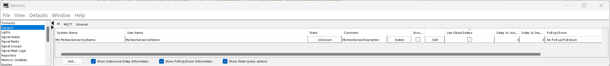

  -----------------------------------------------------------------------
  MyRailIO
  -----------------------------------------------------------------------
  User guide

  Version: 0.0.1
  -----------------------------------------------------------------------

+-----------------------------------------------------------------------+
| Jonas Bjurel                                                          |
|                                                                       |
| 7-6-2024                                                              |
+=======================================================================+
+-----------------------------------------------------------------------+

©

MyRailIO^©^ User guide

A model railway controller backend for signal masts-, sensors-, light
effects-, actuators and more.

**Content:**

[License and copyright
[3](#license-and-copyright)](#license-and-copyright)

[Resources [3](#resources)](#resources)

[Introduction [3](#introduction)](#introduction)

[Features [4](#features)](#features)

[High-level architecture
[5](#high-level-architecture)](#high-level-architecture)

[MyRailIO Server [6](#myrailio-server)](#myrailio-server)

[MyRailIO Decoders and Satellites
[6](#myrailio-decoders-and-satellites)](#myrailio-decoders-and-satellites)

[MyRailIO managed class/object model
[8](#myrailio-managed-classobject-model)](#myrailio-managed-classobject-model)

[MyRailIO administrative-, and operational states
[11](#myrailio-administrative--and-operational-states)](#myrailio-administrative--and-operational-states)

[MyRailIO alarms [12](#myrailio-alarms)](#myrailio-alarms)

[MyRailIO resiliency, reliability, and track safety
[12](#myrailio-resiliency-reliability-and-track-safety)](#myrailio-resiliency-reliability-and-track-safety)

[Hardware [14](#hardware)](#hardware)

[Usage [15](#usage)](#usage)

[Setting up JMRI for MyRailIO operations
[15](#setting-up-jmri-for-myrailio-operations)](#setting-up-jmri-for-myrailio-operations)

[Setting up MyRailIO preferences
[16](#setting-up-myrailio-preferences)](#setting-up-myrailio-preferences)

[Configuring and onboarding a MyRailIO decoder
[20](#configuring-and-onboarding-a-myrailio-decoder)](#configuring-and-onboarding-a-myrailio-decoder)

[Adding and configuring a MyRailIO Light group link
[24](#adding-and-configuring-a-myrailio-light-group-link)](#adding-and-configuring-a-myrailio-light-group-link)

[Adding and configuring a MyRailIO (Signal mast) Light group
[26](#adding-and-configuring-a-myrailio-signal-mast-light-group)](#adding-and-configuring-a-myrailio-signal-mast-light-group)

[Adding and configuring a MyRailIO Satellite link
[30](#adding-and-configuring-a-myrailio-satellite-link)](#adding-and-configuring-a-myrailio-satellite-link)

[Adding and configuring a MyRailIO Satellite
[32](#adding-and-configuring-a-myrailio-satellite)](#adding-and-configuring-a-myrailio-satellite)

[Adding and configuring a MyRailIO Sensor
[34](#adding-and-configuring-a-myrailio-sensor)](#adding-and-configuring-a-myrailio-sensor)

[Adding and configuring a MyRailIO Actuator
[36](#adding-and-configuring-a-myrailio-actuator)](#adding-and-configuring-a-myrailio-actuator)

[Understanding, and working with MyRailIO configurations
[40](#understanding-and-working-with-myrailio-configurations)](#understanding-and-working-with-myrailio-configurations)

[Understanding, and working with MyRailIO administrative- and
operational states
[42](#understanding-and-working-with-myrailio-administrative--and-operational-states)](#understanding-and-working-with-myrailio-administrative--and-operational-states)

[Understanding, and working with MyRailIO alarms
[44](#understanding-and-working-with-myrailio-alarms)](#understanding-and-working-with-myrailio-alarms)

[Understanding and working with MyRailIO performance metrics
[47](#understanding-and-working-with-myrailio-performance-metrics)](#understanding-and-working-with-myrailio-performance-metrics)

[Understanding and working with MyRailIO inventories
[47](#understanding-and-working-with-myrailio-inventories)](#understanding-and-working-with-myrailio-inventories)

[Understanding MyRailIO restarts, escalations, and fail-safe
[50](#understanding-myrailio-restarts-escalations-and-fail-safe)](#understanding-myrailio-restarts-escalations-and-fail-safe)

[MyRailIO troubleshooting
[51](#myrailio-troubleshooting)](#myrailio-troubleshooting)

[MyRailIO decoder upgrade
[52](#myrailio-decoder-upgrade)](#myrailio-decoder-upgrade)

[System requirements, dependencies, and compatibility
[53](#system-requirements-dependencies-and-compatibility)](#system-requirements-dependencies-and-compatibility)

[Installation [53](#installation)](#installation)

[References [53](#references)](#references)

# License and copyright

This document is licensed under the Creative Commons
Attribution-NonCommercial-ShareAlike 4.0 International License (CC
BY-NC-SA 4.0). This means that you are free to copy and redistribute the
material in any medium or format, and remix, transform, and build upon
the material, as long as you give appropriate credit to the original
author, use the material for non-commercial purposes only, and
distribute your modifications under the same license as the original.

MyRailIO^©^ is a trademark of Jonas Bjurel. All rights reserved. The
MyRailIO logo is a copy right design of Jonas Bjurel and may not be used
outside of the MyRailIO project without permission.

# Resources

All MyRailIO resources can be found at <https://www.myrail.io/>

The MyRailIO source code can be found at
<https://github.com/jonasbjurel/myRailIO>

# Introduction

MyRailIO (maɪreɪlio) provides an Input/Output peripheral backend to
model railway controllers such as JMRI, RockRail, etc. (at current only
JMRI is supported).

MyRailIO provides flexible and configurable capabilities for the model
railway controller to throughout the layout capture diverse types of
sensors-, control multiple types of signaling masts-, control diverse
types of light-effects-, and maneuver actuators such as turnouts-,
servos-, and solenoids.

The myRailIO decoders run on multiple cheap ESP32 micro controllers,
each connected to multiple cheap I/O satellite FPGAs; All managed and
supervised by a centralized management software which in principle is OS
independent (currently only evaluated with Windows 11). The MyRailIO
management software provides a Graphical User Interface for overall
MyRailIO configuration-, status-, alarm-, performance metrics-, and
log/event overview. Apart from a view of the current state of these
metrics, the history of these metrics is stored and can be viewed with
associated time-stamps for later trouble-shooting and debug post-mortem.

The design is entirely open source and licensed under the Apache version
2.0 license (ASLv2), contribution of features-, code-, CI/CD-, testing-,
trouble reporting and bugfixes are highly appreciated.

# Features

MyRailIO features a scalable and distributed architecture for model
train control peripherals such as:

-   Signal masts (any signal system supported by the Train controller)

-   General Light groups where several (tri-colored) pixels work
    together creating various light effects.

-   Sensors (currently only digital sensors)

-   Actuators (on/off, pulse, solenoid, pwm)

Special attention has been paid to scalability and extensibility.

MyRailIO can easily be extended with new Light group effects such as
multiple road work lights playing in concert, or simulation of
Television ambient flicker, etc. Although it currently only integrates
with the JMRI Train controller it should be straight forward to
integrate with other Train controllers. Scalability is achieved by
adding more MyRailIO decoders and satellites, all managed by one central
MyRailIO server.

Although not redundant, the goal is to fail fast and reliably apply
fail-safe measures avoiding unsafe track movements and keeping the
safety as a center pillow.

Moreover, MyRailIO supports the following features:

-   A decoder CLI for debugging.

-   NTP time synchronization.

-   RSysLog for log aggregation and log rotation.

-   Statistics and performance metrics.

-   Alarms and alarm lists.

# High-level architecture

The architecture depicted below shows how myRailIO is composed of the
central management server, one or more MyRailIO decoders, each of them
connected to zero or more I/O satellites. These components interact with
the Train controller which is responsible to issue Signal mast, light
and actuator orders, as well as consuming sensor data. The main
communication procedures across these components are via MQTT -- a light
weight pub/sub bus, however Remote Procedure Calls (RPC) are used
in-between the MyRailIO management server and the Train controller.

{width="7.072222222222222in"
height="3.9784722222222224in"}

## MyRailIO Server

The MyRailIO (management) server is responsible for the configuration
and management of the underlying decoders. It is also the main
integration point with various model railway controllers. It
communicates with the Train controller through Remote Procedure Calls
(RPC) to exchange status and configure the controller to directly
communicate with the MyRailIO decoders. The RPC server is a piece of
software that implements a set of management and configuration methods
defined by the RPC client; these methods are used to exchange
configuration and status information. The RPC server runs in the context
of the Train controller, and in the JMRI case it is implemented as a
JMRI Jython script.

To ensure low latency and high robustness the actual signal mast-,
light-, actuator-, and sensor information is communicated directly
between the Train controller and the MyRailIO decoders using MQTT and
never via the MyRailIO server.

Another important aspect of the MyRailIO architecture is to maintain
separation of concerns between MyRailIO and the Train controller such
that it is possible to integrate with other Train controllers without
impacting the core and protocols of MyRailIO, this is done by
concentrating the adaptations in the RPC server alone, acting as a shim
layer.

The MyRailIO server is also responsible for configuring all the managed
objects of the decoder and otherwise, it provides a Graphical User
Interface (GUI) for all of the configurations and pushes the
configuration to all of its decoders. It also keeps track of the status
for all the managed objects, provides an alarm list for the managed
objects, and aggregates all the logs from the decoders.

The MyRailIO server and the related RPC components are all implemented
in Python and are in principle platform independent.

## MyRailIO Decoders and Satellites

One or several MyRailIO decoders can be connected to a MyRailIO server
using MQTT/IP/WiFi. The decoder implements all necessary supervision-
and business logic to control signal mast aspects, lights and light
effects, actuators; as well as delivering sensor data in a reliable and
effective way.

The MyRailIO decoder runs on cheep ESP32 micro-controllers and is
implemented in C++.

The following concepts are fundamental for the understanding and
operation of MyRailIO and the MyRailIO decoder.

### Light group and Light group link

A Light group is a set of LEDs or multi-color pixels that sits on a
Light group link and together forms some sort of managed object.
Example: a signal mast with one or multiple signal lights, a set of road
work warning lights with synchronized aspects, a multi-color pixel
emulating a television ambient flicker, etc. The decoder does not itself
have the notion of light group aspects or pixel effects, the mapping
between an aspect name and the actual behavior comes as configuration
data from the server. In that way, many types of Light groups can be
defined and share the same Light group link, and the signaling system
used (Swedish, German, US, ...) is just a matter of configuration.
Although there is a limit to how many pixels the Light group link can
carry, a set (more than one) can sit on the same Light group link.

A Light group links is a serial link based on the WS2811/WS2812 protocol
on which the light groups sit. Up to two Light group links can be
connected to a MyRailIO decoder.

### Sensors, Actuators, Satellite and Satellite links

Many sensors and actuators can be connected to MyRailIO. These are
connected to MyRailIO via so-called Satellites. A sensor is currently a
binary sensor (analogue sensors are on the to-do list), up to 8 sensors
can be connected to a MyRailIO satelite. Up to 4 actuators can be
connected to a MyRailIO Satellite. These actuator ports can be
configured for various purposes such as: on/off, pulse, solenoid, servo,
pwm, etc.

As mentioned above, the MyRailIO satelite implements the sensor and
actuator ports. One or more Satellites can be connected to a Satelite
link connected to the decoder. The Satellite link implements a ring
topology using a proprietary serial protocol where Satelite orders,
meta-data, and fault detection checksums are shifted out from the
MyRailIO decoder, while sensor-, and fault data is retrieved by the
decoder in the other end of the SateliteLink. The Satellites monitors
that there are regular Satelite link polls, and if that is not the case
-- watchdog errors will be reported back to the decoder. With this
implementation, the Satelite link can be monitored for transmit- and
receive errors, watchdog errors, etc. Similarly, each satelite can be
monitored for transmit-, receive and watchdog errors that it has been
impacted by. In case a Satelite experiences a receive error the actuator
state will remain the same as for the previous poll interval.

A MyRailIO decoder can connect up to two Satelite links.

The MyRailIO Satellites are implemented with a cheap FPGA
implementation, see the open-source project here
[jonasbjurel/genericIOSatellite: A model railway stackable and large
scale sensor and actuator framework
(github.com)](https://github.com/jonasbjurel/genericIOSatellite)

## MyRailIO managed class/object model

MyRailIO implements a hierarchical managed class model where each class
implements business-, supervision-, and management logic for a certain
resource type. Each managed class gets instantiated in one or more
managed objects with a certain configuration, operating and supervising
a particular resource instance (E.g., a sensor).

The following managed class models are defined: topDecoder, decoder,
lightGroupLink, lightGroup, sateliteLink, satelite, actuator, and
sensor.

{width="7.072222222222222in"
height="3.9784722222222224in"}

The managed Object Model is hierarchical with the cardinality as shown
above. Each managed object holds its own configuration with its own GUI
and CLI context. All of the managed objects except the topDecoder carry
an object system name, an object username and an object description
collectively later referred to as "object identification". The system
name is a globally unique name which cannot be altered once configured,
the object username is a lazy descriptive name which can be altered at
any time, just like the object description. For the managed class
objects which the Train controller need to be aware of - the system
names need to correspond between MyRailIO and the Train controller and
need to adhere to the Train controller's system name conventions, those
managed class objects are: "lightGroup", "actuator", and "sensor"; the
Train controller is entirely unaware of the rest of the managed object
classes.

### topDecoder

The topDecoder management object is a singleton, unlike all the other
managed objects it does not manage any physical resources, but rather
holds configurations common to the entire MyRailIO setup, such as NTP-,
RSysLog-, MQTT-, and RPC configurations and it is responsible for the
server communication.

### decoder

The decoder managed object manages the configuration- and operations of
a MyRailIO decoder. It holds information such as the decoder identity
(MAC Address)-, object identification-, administrative blocking state-,
operational state-, and various performance metrics of the decoder.

### lightGroupLink

The lightGroupLink managed object manages the configuration- and
operations of a MyRailIO lightGroupLink. It holds information such as
the object identification-, link number-, administrative blocking
state-, operational state-, and various performance metrics of the
lightGroupLink.

### lightGroup

The lightGroup managed object is (like actuator and sensor) a bit
different than the others. It is a "stem object" which has no DNA and is
unaware of the actual type of Light group it will eventually represent.
At configuration of the Light group, it will in run-time inherit a
"lightGroupType" DNA class object which will implement the actual
functionality of the light-group. Examples of a lightGroupType is
"signalMast" -- more about this later.

The lightGroup managed object manages the configuration- and operations
of a MyRailIO lightGroup. It holds information such as the object
identification-, lightGroup address, administrative blocking state-,
operational state-, current aspect, and various performance metrics of
the lightGroup.

### satelliteLink

The satelliteLink managed object manages the configuration- and
operations of a MyRailIO satelliteLink. It holds information such as the
object identification-, link number-, administrative blocking state-,
operational state-, and various performance metrics of the sateliteLink.

### satellite

The satellite managed object manages the configuration- and operations
of a MyRailIO satellite. It holds information such as the object
identification-, satellite address-, administrative blocking state-,
operational state-, and various performance metrics of the satelite.

### actuator

The actuator managed object is (like the lightgroup and sensor) a bit
different than the others. It is a "stem object" which has no DNA and is
unaware of the actual type of Actuator it will eventually represent. At
configuration of the Actuator, it will in run-time inherit a
"actuatorType" DNA class object which will implement the actual
functionality of the actuator. Examples of actuatorTypes are "actMem"-,
"actLight"-, and "actTurn" -- more about this later.

The actuator managed object manages the configuration- and operations of
a MyRailIO actuator. It holds information such as the object
identification-, actuator port, administrative blocking state-,
operational state-, current position, and various performance metrics of
the actuator.

### sensor

The sensor's managed object is (like lightgroup and actuator) a bit
different than the others. It is a "stem object" which has no DNA and is
unaware of the actual type of Sensor it will eventually represent. At
configuration of the Sensor, it will in run-time inherit a "sensorType"
DNA class object which will implement the actual functionality of the
sensor. An example of an "sensorType" is "sensDigital" -- more about
this later.

The actuator's managed object manages the configuration- and operations
of a MyRailIO actuator. It holds information such as the object
identification-, actuator port, administrative blocking state-,
operational state-, current position, and various performance metrics of
the actuator.

## MyRailIO administrative-, and operational states

MyRailIO uses the concept of "administrative states" and "operational
states". Each managed object has an "administrative state" and
"operational state".

The administrative state of a managed object is a result of a manual
intervention -- "Enabling" or "Disabling" a managed object. By
"Disabling" a managed object it is no longer operational, but in
maintenance mode - such that reconfiguration of the managed object is
allowed. Any reconfiguration during a "Disabled" maintenance period is
never propagated to the actual managed object resource until the managed
object is "Enabled" through manual intervention. A managed object cannot
be reconfigured when "Enabled". To "Disable" a managed object requires
that all subsequent hierarchic managed objects be "Disabled" -- and thus
out of operation. E.g., disabling a Satelite managed objects requires
that all its actuators-, and sensors managed objects are "Disabled" in
forehand. A "Disabled" managed object triggers the "DABL" (Disabled)
operational state bit to be set for that managed object -- see
operational states below.

The operational state of a managed object reflects the functional/error
state of that managed object. Operational states propagate down into all
subsequent hierarchical management objects such that if the parent
managed object of a managed object has any of its operational state bits
set, the "CBL" (Control Blocked) operational state bit is set -- which
will trickle further down in the managed object hierarchy. Operational
state bits are set as a consequence of managed object initialization-,
managed object-, and managed object parent faults. Some examples of
operational state bits (more than one can be set at the same time):

-   "INIT": The managed object is initializing.

-   "DISC": The managed object is disconnected (I.e., from WiFi-, MQTT-,
    or RPC).

-   \"NOIP\": The managed object has not been assigned an IP-address.

-   "UDISC": The managed object has not been discovered.

-   "UCONF": The managed object has not been configured.

-   "DABL": The managed object has been administratively "Disabled" --
    see above.

-   \"SUAVL\": The MyRailIO server is missing excessive ping supervision
    messages from a decoder.

-   \"CUAVL\": A MyRailIO decoder is missing excessive ping supervision
    messages from the server.

-   "ESEC": A Satelite link or a Satelite has experienced a second with
    extensive errors.

-   "ERR": The managed object has experienced a recoverable error.

-   "FAIL": The managed object has experienced an unrecoverable error.

-   "CBL": The managed object is control blocked due to errors higher up
    in the managed object hierarchy.

-   "UUSED": The managed object is unused.

Whenever a managed object has one of its operational status bits set it
is considered non-operational/un-safe, and consequently any physical
resources related to the managed object are set in a fail-safe mode -
preventing any consequent unsafe train movements.

## MyRailIO alarms

MyRailIO uses the concept of alarms. An alarm is a stateful event
indicating a malfunction, an alarm is raised whenever a malfunction
appears, and is ceased when the malfunction situation disappears. Alarms
as such do not declare a managed object down, and do not trigger any
fail-safe operations -- on the contrary alarms may be the result of a
managed object operational state transition that has triggered a
failsafe operation, but an alarm does not by itself. Furthermore, alarms
do not necessarily relate to managed objects, but may be connected to
any logic failures that have a stateful property (the failure can come
and go).

Alarms comes with three different priorities:

-   "A": A Critical alarm indicating that certain MyRailIO services may
    be inoperative all together.

-   "B": A Non-critical alarm indicating that certain MyRailIO services
    maybe degraded in its\
    operations.

-   "C": A notice alarm indicating that certain MyRailIO services may be
    limited in their functionality, but in no way impacting the
    operations.

MyRailIO alarms are captured and stored in an alarm-list, the alarm-list
captures active alarms, as well as all historical inactive/ceased alarms
with: Alarm Id, Severity, Raise-time, Cease-time, duration, Alarm-type,
Alarm-source, Alarm-slogan, Alarm-raise reason, and Alarm-cease reason.

At current, the alarm-list is volatile and resets after each MyRailIO
restart.

## MyRailIO resiliency, reliability, and track safety

MyRailIO is its nature inherently non redundant, a failure in one of its
components caused by unrecoverable software-, communication-, or
configuration errors will lead to disruption of the MyRailIO operations
-- and thereby inability to set signal mast aspects, actuators, and
detect sensor inputs. The strategy to manage such faults is to "fail
fast", and in these failure scenarios have several layers of software
error exemption handlers that tries to apply the proper fail-safe
mechanisms including:

-   Setting Signal masts, Turnouts and Actuators in a failsafe position.

-   Setting the sensor values reported to the Train controller in a
    failsafe position.

-   Optionally turning of the track power.

To early detect errors, MyRailIO implements several layers of
supervision and fault detection mechanisms:

-   Each process-, task-, and poll-loop is supervised by watch dogs.

-   All communication paths are supervised by keep-alive supervision
    messages.

-   All communication have checksums appended.

# Hardware

The hardware is not currently part of this project, we may later decide
to create printed circuit

The decoder pin-out is as follows:

  ------------------------------------------------------------------------
  **Signal:**              **ESP32    **Comment:**
                           PIN:**     
  ------------------------ ---------- ------------------------------------
  LGLINK_TX_CHANNEL_0      25         

  LGLINK_TX_CHANNEL_1      26         

  SATLINK_TX_CHANNEL_0     18         

  SATLINK_RX_CHANNEL_1     19         

  SATLINK_TX_CHANNEL_0     21         

  SATLINK_TX_CHANNEL_1     22         

  PROVISIONING_BUTTON      27         Active low
  ------------------------------------------------------------------------

The satelite hardware and pin-out is described here:
[jonasbjurel/genericIOSatellite: A model railway stackable and large
scale sensor and actuator framework
(github.com)](https://github.com/jonasbjurel/genericIOSatellite)

# Usage

This section assumes a correct installation of JMRI, MyRailIO, and an
MQTT broker (See the installation section further down).

## Setting up JMRI for MyRailIO operations

First JMRI needs to be set up to work with MyRailIO.

JMRI must be configured to interwork with your MQTT broker. From JMRI
PanelPro go to "edit/preferences":

-   Select "MQTT" as system manufacturer.

-   Select "MQTT Connection" as the System connection.

-   Provide the IP-address for your MQTT broker.

-   And fill in the prefix, the connection name, and the topics as shown
    below.

-   Finally select Save.

{width="2.7559055118110236in"
height="2.767716535433071in"}

##  

JMRI must also be configured to run the MyRailIO RPC server. From JMRI
PanelPro go to "Scripting/Run Script" and select the
"myRailIoRpcServer.py" file found under: "server/scripts/rpc" in the
MyRailIO repository.

{width="2.7559055118110236in"
height="2.0866141732283463in"}

This concludes the set-up of JMRI for MyRailIO operations.

## Setting up MyRailIO preferences

Start the "myRailIOd.py" Python program found under
"server/Scripts/myRailIO" in the MyRailIO repository. This will cause
the MyRailIO Graphical User Interface (GUI) to pop up:

{width="3.0813495188101485in"
height="2.482688101487314in"}

Right-click on the topDecoder object and select "Edit":

{width="2.7559055118110236in"
height="4.24015748031496in"}

Edit configuration meta data such as "Author", "Description", "Version",
and date. The git fields are for future git operations and are not yet
implemented.

Edit the RPC parameters:

-   "RPC URL" is the URL or the IP address of the JMRI RPC server, if
    JMRI runs on the same host as the MyRailIO server, "localhost" or
    "127.0.0.X" can be used.

-   "RPC port base" is the starting port in a series of ports used for
    the RPC communication (currently 2). Use 8000 as that is currently a
    hardcoded value in the RPC server.

-   "RPC keep-alive" is the RPC supervision keep-alive period. After
    three consecutive missed keep-alive messages the RPC session is
    deemed down. Shortening the keep-alive period allows for faster RPC
    fault detection. The recommended value is in-between 1- and 10
    seconds depending on fault detection needs.

Edit the MQTT parameters:

-   "MQTT URL" is the URL or the IP address of the MQTT broker, if the
    MyRailIO server runs on the same host as the MQTT broker,
    "localhost" or "127.0.0.X" can be used. For Demo purposes the cloud
    demo service "test.mosquitto.org" can be used.

-   "MQTT port" is the MQTT destination port. 1883 is the standard MQTT
    port.

-   "MQTT Topic pre-fix" defines a string used as a standard MQTT topic
    pre-fix. "/trains" is typically used for MQTT.

-   "MQTT Ping-period" defines the end to end (server-decoder) ping
    supervision period. After three consecutive missed ping messages the
    decoder connection is deemed down. Shortening the ping period allows
    for faster decoder fault detection. The recommended value is
    in-between 1- and 10 seconds depending on fault detection needs.

-   "MQTT Keep-alive" defines the server to MQTT broker keep-alive
    supervision period. After three consecutive MQTT keep-alive messages
    the MQTT session is deemed down. Shortening the keep-alive period
    allows for faster MQTT fault detection. The recommended value is
    in-between 10- and 60 seconds depending on fault detection needs.

Edit the time parameters:

-   "NTP URL" defines the NTP server that decoders will synchronize time
    with.

-   "Time Zone" defines the local time-zone which the decoders should
    use.

Edit the RSyslog parameters:

-   "RSyslog URL" defines the SysLog server URL/IP-address to which the
    decoders should send their logs. If the URL/IP-address is the same
    as used by the MyRailIO server, the logs will be sent to the
    Server's built-in RSyslog server, and all logs will be visible from
    the MyRailIO server.

-   "Log verbosity" sets the verbosity of all logs: Including Decoder
    logs, Server Logs, and RPC server logs.

-   "RSyslog file" defines the log base file name and path. All logs
    from the built-in RSyslog servers will be written to this file.

-   "Logrotate \# Files" Defines number of files for which the RSyslog
    servers should logrotate.

-   "Logrotate file size" Defines the size of the log file before
    logrotate happens.

Enable or disable decoder failsafe by clicking/un-clicking the "Decoder
failsafe" check-box. Set all decoders- and decoder\'s objects in
fail-safe if an error exists - no matter where in the object hierarchy
the error resides. \[NOT IMPLEMENTED\]

Enable or disable Tracks failsafe by clicking/un-clicking the "Tracks
failafe\" check-box. Turns off track power if an error exist - no matter
where in the object hierarchy the error resides \[NOT IMPLEMENTED\]

The administrative state can be changed to "ENABLE" in the "Admin.
state" selection box. If the "Recursive" check-box is checked, the
administrative state of all child objects will assume the same
administrative state.

Click "Accept" to accept the configuration.

If you have not already enabled the Top decoder, right-click on the
decoder object and select "Enable". If the configuration is correct, the
topDecoder object should turn color from grey to green as shown below,
this means that the decoder's operational state is "Available".

{width="2.7559055118110236in"
height="2.4960629921259843in"}

## Configuring and onboarding a MyRailIO decoder

Before a MyRailIO decoder can be discovered and onboarded by the
MyRailIO server it needs to be provisioned with some day-0
configuration. This is done through a provisioning web portal server
residing on the decoder. This portal is enabled by pressing the
decoder's provisioning button for \~50 seconds after resetting the
decoder -- see the Hardware section to identify the provisioning button.
This will erase all the configuration of the decoder; it will start a
local WiFi access point and the provisioning portal. The Access point
SSID starts with "myRailIOConfAP\_" followed by the decoders MAC
address.

{width="1.968503937007874in"
height="2.1692913385826773in"}

Connect to the Decoder's WiFi and open a Web browser, if the browser
does not re-direct to the provisioning portal, enter 10.0.0.2 in the
browser's address field.

{width="2.7559055118110236in"
height="2.6535433070866143in"}

Select "Info" to capture the MAC address of the decoder as part of the
SSID shown on the top of the page, you will need it later.

{width="2.7559055118110236in"
height="5.55511811023622in"}

Select one of the shown WiFi SSIDs or type in one manually, enter the
WiFi password. If none of the static address fields are entered - DHCP
will be used, otherwise static addresses will be used.\
Enter the "MQTTserverURI" and "MQTTserverPort" which should be the same
as was provided for the topDecoder configuration.

Press "Save"

The decoder should now be provisioned for on-boarding with the MyRailIO
server.

Go back to your previous/normal WiFi SSID.

From the MyRailIO Server GUI -- right-click on the topDecoder object and
select "Add" and then select "Decoder".

{width="2.7559055118110236in"
height="2.484251968503937in"}

When adding a decoder to the topDecoder, a decoder configuration dialog
will appear. Fill in the configuration as follows:

{width="2.7559055118110236in"
height="2.338582677165354in"}

-   "System name" This is an immutable system identifier that needs to
    begin with the "GJD-" pre-fix. As the MyRailIO Decoder concept is
    unknown to the Train controller, this system identifier will also be
    un-known to the Train controller.

-   "User name" defines a lazy user name for the decoder.

-   "URI" Defines the decoder URI used for MQTT message addressing. It
    does not need to be resolvable by any DNS, but it needs to be unique
    for the MyRailIO deployment, and it needs to follow the URI format:
    \<resource\>.\<domain\>.\<topDomain\>

-   "MAC Address" defines the MAC address of the decoder as we recorded
    when we provisioned the decoder.

-   "Description" provides a description of the decoder.

The administrative state can be changed to "ENABLE" in the "Admin.
state" selection box. If the "Recursive" check-box is checked, the
administrative state of all child objects will assume the same
administrative state.

Click "Accept" to accept the configuration.

If you have not already enabled your newly configured decoder,
right-click on the decoder object and select "Enable". If the
configuration is correct, the Decoder object should after a while turn
color from grey to green as shown below, this means that the decoder's
operational state is "Available". In the background a decoder
configuration will be compiled from all relevant managed objects and
pushed to the decoder after the decoder has been restarted.

{width="2.7559055118110236in"
height="2.4921259842519685in"}

## Adding and configuring a MyRailIO Light group link

The MyRailIO Light group link concept is fundamental for MyRailIO Light
groups, it is the carrier of Light group aspect information and
represents the physical link for that information. Many Light groups may
share the same Light group link, and a MyRailIO decoder can connect up
to two Light group links.

To add a Light group link -- go to MyRailIO Server GUI -- right-click on
the decoder object to which you want to connect the Light group link -
select "Add" and select "Light group link".

{width="2.7559055118110236in"
height="2.4960629921259843in"}

When adding a Light group link to a decoder, a Light group link
configuration dialog will appear. Fill in the configuration as follows:

{width="2.7559055118110236in"
height="1.8346456692913387in"}

-   "System name" This is an immutable system identifier that needs to
    begin with the "GJLL-" pre-fix. As the MyRailIO Light group link
    concept is unknown to the Train controller, this system identifier
    will also be un-known to the Train controller.

-   "User name" defines a lazy user name for the Light group link.

-   "Description" provides a plane description of the Light group link.

-   "Link number" defines the physical Light group link connected to the
    decoder. See the HW section for link number pin-out.

-   "Mast definition path" defines the path to the Train controller's
    signaling system definitions, this path is relative to the Train
    controller's path on the train controller host, and not relative to
    the MyRailIO server path/host. In fact, these signaling mast
    definitions are pulled via the RPC interface from the Train
    controller host. As signal masts are just one type of Light groups,
    we could argue why this definition resides under the Light group
    link. However, these definitions tend to be quite large making it
    unpractical to have them defined per signal mast Light group
    definition. This means that on the same Light group link, only one
    signaling system (Sweden, Germany, US) may occur which is not a real
    issue. The issue is more of an architectural conceptual issue, as
    these definitions really do not have a place in the Light group link
    managed objects. This may change over time.

The administrative state can be changed to "ENABLE" in the "Admin.
state" selection box. If the "Recursive" check-box is checked, the
administrative state of all child objects will assume the same
administrative state.

Click "Accept" to accept the configuration.

If you have not already enabled your newly configured Light group link,
right-click on the Light group link object and select "Enable". If the
configuration is correct, the Light group link object should after a
while turn color from grey to green as shown below, this means that the
Light group link's operational state is "Available". In the background a
decoder configuration will be compiled from all relevant managed objects
and pushed to the decoder after the decoder has been restarted.

## Adding and configuring a MyRailIO (Signal mast) Light group 

The MyRailIO Light group concept provides a powerful way to combine one
or several monochrome or tri-colored pixel elements into one managed
object, which can illuminate the various pixels in a concert, creating
all kind of light effects-, and aspects -- controlled by the Train
controller.

To add a Light group -- go to MyRailIO Server GUI -- right-click on the
Light group link object to which you want to connect the Light group -
and select "Add" and select "Light group".

{width="2.7559055118110236in"
height="2.4960629921259843in"}

When adding a Light group to a Light group link, a Light group
configuration dialog will appear. Fill in the configuration as follows:

{width="3.4117246281714784in"
height="3.104669728783902in"}

-   "Type" Start with selecting the type of Light group type, at current
    "SIGNAL MAST" is the only supported Light group type. Common for all
    Light group types is that the fail-safe aspect/signature is all
    lights on.

-   "JMRI system name" This selection box will now show all the signal
    masts already defined in JMRI but not yet defined in MyRailIO, you
    can pick one of them or you can define your own which will then be
    populated in JMRI. If you chose to define your own go and select
    your mast type in the "Mast type" selection box and a template
    system name will appear in the "JMRI system name" selection box,
    edit the "(\$nnnn)" field with a unique 4 digit signal mast
    identifier number.\
    Note that the "JMRI system name" must have the following format:
    IF\$vsm:\<signal system type\>:\<signal mast type\>(\$\<nnnn\>),
    where \<nnnn\> must be an unique 4 digit number.

-   "JMRI user name" defines the lazy user name of the signal mast. If
    an already defined JMRI signal mast is picked from the "JMRI System
    name" selection box, the "JMRI user name" is auto-filled.

-   "JMRI description" provides a description of the signal mast. If an
    already defined JMRI signal mast is picked from the "JMRI System
    name" selection box, the "JMRI description" is auto-filled.

-   "Link Address" Defines the address on the Light group link on which
    the Light group is attached to. That is the sequence number of the
    Light group starting from the beginning of the Light group link.

-   "Mast type" Defines one of the signal mast types defined by the
    signal system type defined by the Light group link. If an already
    defined JMRI signal mast is picked from the "JMRI System name"
    selection box, the "Mast type" is auto-filled.

-   "Dimming time" Defines the emulated bulb filament dimming time.

-   "Flash freq." Defines the flashing frequency for flashing aspects.

The administrative state can be changed to "ENABLE" in the "Admin.
state" selection box. If the "Recursive" check-box is checked, the
administrative state of all child objects will assume the same
administrative state.

Click "Accept" to accept the configuration.

If you have not already enabled your newly configured Light group l,
right-click on the Light group object and select "Enable". If the
configuration is correct, the Light group object should after a while
turn color from grey to green as shown below, this means that the Light
group link's operational state is "Available". In the background a
decoder configuration will be compiled from all relevant managed objects
and pushed to the decoder after the decoder has been restarted.

{width="3.6419674103237094in"
height="2.4557272528433947in"}

From JMRI PanelPro go to "Tools"-\>"Tables"-\>"Signals"-\>"Signal Masts"
and select an aspect for your newly configured Signal mast, the
corresponding aspect should now show on your physical Signal mast.

{width="6.8121183289588805in"
height="0.889426946631671in"}

## Adding and configuring a MyRailIO Satellite link

The MyRailIO Satellite group link concept is fundamental for MyRailIO
Satellites, Sensors and actuators; it is the carrier of Satellite
control information as well as Sensor and Actuator information and
represents the physical link carrying that information. Many Satellites
may share the same Satellite link, and a MyRailIO decoder can connect up
to two Satellite links.

To add a Satellite link -- go to MyRailIO Server GUI -- right-click on
the decoder object to which you want to connect the Satellite link -
select "Add" and select "Satellite link".

{width="2.7559055118110236in"
height="2.5in"}

When adding a Satellite link to a decoder a Satellite link configuration
dialog will appear. Fill in the configuration as follows:

{width="2.7559055118110236in"
height="2.606299212598425in"}

-   "System name" This is an immutable system identifier that needs to
    begin with the "GJSL-" pre-fix. As the MyRailIO Satellite link
    concept is unknown to the Train controller, this system identifier
    will also be un-known to the Train controller.

-   "User name" defines a lazy user name for the Satellite link.

-   "Description" provides a plane description of the Satellite link.

-   "Link number" defines the physical Satellite link connected to the
    decoder. See the HW section for link number pin-out.

The administrative state can be changed to "ENABLE" in the "Admin.
state" selection box. If the "Recursive" check-box is checked, the
administrative state of all child objects will assume the same
administrative state.

Click "Accept" to accept the configuration.

If you have not already enabled your newly configured Satellite link,
right-click on the Light group link object and select "Enable". If the
configuration is correct, the Satellite link object should after a while
turn color from grey to green as shown below, this means that the
Satellite link's operational state is "Available". In the background a
decoder configuration will be compiled from all relevant managed objects
and pushed to the decoder after the decoder has been restarted.

{width="2.7559055118110236in"
height="2.5039370078740157in"}

## Adding and configuring a MyRailIO Satellite

The MyRailIO Satellite concept provides a distributed concentrator for
Sensors and actuators, and sits on an MyRailIO Satelite link.

To add a Satellite -- go to MyRailIO Server GUI -- right-click on the
Satelite link object to which you want to connect the Satellite - select
"Add" and select "Satellite".

{width="2.7559055118110236in"
height="2.5in"}

When adding a Satellite to a Satelite link a Satellite configuration
dialog will appear. Fill in the configuration as follows:

{width="2.7559055118110236in"
height="2.3858267716535435in"}

-   "System name" This is an immutable system identifier that needs to
    begin with the "GJSAT-" pre-fix. As the MyRailIO Satellite concept
    is unknown to the Train controller, this system identifier will also
    be un-known to the Train controller.

-   "User name" defines a lazy user name for the Satellite.

-   "Description" provides a plane description of the Satellite.

-   "Address" Defines the address on the Satelite link on which the
    Satelite is attached to. That is the sequence number of the Light
    group starting from the end of the Light group link, **NOTE THAT IN
    CONTRATORY TO LIGHT GROUPS ON THE LIGHT GROUP LINK, THE ADDRESSING
    OF SATELITES ON THE SATELITE LINK IS COUNTING FROM THE END
    (TERMINATION) OF THE SATELITE LINK.**

The administrative state can be changed to "ENABLE" in the "Admin.
state" selection box. If the "Recursive" check-box is checked, the
administrative state of all child objects will assume the same
administrative state.

Click "Accept" to accept the configuration.

If you have not already enabled your newly configured Satelite,
right-click on the Satelite object and select "Enable". If the
configuration is correct, the Satellite object should after a while turn
color from grey to green as shown below, this means that the Light group
link's operational state is "Available". In the background a decoder
configuration will be compiled from all relevant managed objects and
pushed to the decoder after the decoder has been restarted.

{width="2.7559055118110236in"
height="2.5039370078740157in"}

## Adding and configuring a MyRailIO Sensor

The MyRailIO Satelite concept provides distributed Sensor capabilities.

To add a Sensor -- go to MyRailIO Server GUI -- right-click on the
Satelite object to which you want to connect the Sensor - and select
"Add" and select "Sensor".

{width="2.7559055118110236in"
height="2.5in"}

When adding a Sensor to a Satelite, a Sensor configuration dialog will
appear. Fill in the configuration as follows:

{width="2.7559055118110236in"
height="2.1850393700787403in"}

-   "JMRI system name" This selection box will now show all the Sensors
    already defined in JMRI but not yet defined in MyRailIO, you can
    pick one of them or you can define your own which will then be
    populated in JMRI. If you chose to define your own it needs to start
    with the "MS-" pre-fix.

-   "JMRI user name" defines the lazy user name of the Sensor. If an
    already defined JMRI Sensor is picked from the "JMRI System name"
    selection box, the "JMRI user name" is auto-filled.

-   "JMRI description" provides a description of the Sensor. If an
    already defined JMRI Sensor is picked from the "JMRI System name"
    selection box, the "JMRI description" is auto-filled.

-   "Sensor port" Defines the Sensor port on the Satelite on which the
    Sensor is attached to.

-   "Sensor type" Defines the Sensor port type -- "DIGITAL" is currently
    the only supported sensor type. The fail-safe position is ?
    **\[TODO: PAYLOAD IS FAILSAFE, HOW IS THAT INTERPRETED BY JMRI?\]**

The administrative state can be changed to "ENABLE" in the "Admin.
state" selection box. If the "Recursive" check-box is checked, the
administrative state of all child objects will assume the same
administrative state.

Click "Accept" to accept the configuration.

If you have not already enabled your newly configured Sensor,
right-click on the Satelite object and select "Enable". If the
configuration is correct, the Sensor object should after a while turn
color from grey to green as shown below, this means that the Sensor's
operational state is "Available". In the background a decoder
configuration will be compiled from all relevant managed objects and
pushed to the decoder after the decoder has been restarted.

{width="2.7559055118110236in"
height="2.5039370078740157in"}

From JMRI PanelPro go to "Tools"-\>"Tables"-\>"Sensors" and watch the
state of the newly created Sensor -- it should follow the input to your
newly configured physical sensor.

{width="6.902036307961505in"
height="0.7770680227471566in"}

## Adding and configuring a MyRailIO Actuator

The MyRailIO Satelite concept provides distributed Actuator
capabilities.

To add an Actuator -- go to MyRailIO Server GUI -- right-click on the
Satelite object to which you want to connect the Actuator - and select
"Add" and select "Actuator".

{width="2.7559055118110236in"
height="2.5039370078740157in"}

When adding an Actuator to a Satelite, an Actuator configuration dialog
will appear. Fill in the configuration as follows:

{width="2.7559055118110236in"
height="2.3503937007874014in"}

-   "Actuator type": Start by defining the actuator type, select between
    Turnout, Light, or Memory. This will select to which JMRI control
    mechanism the actuator will be connected.

    -   "Turnout" connects the actuator to JMRI's Turnout control
        mechanism. In this mode the "JMRI System name" must start with
        the "MT-" pre-fix. Turnout allows two "Actuator sub-types":
        "SOLENOID" and "SERVO".

        -   "SOLENOID" Controls a normal solenoid maneuvered servo, this
            sub-type requires two actuator ports, one to maneuver the
            turnout into closed position, and one to one to maneuver the
            turnout into thrown position. The two ports must be adjacent
            to each other and start with an even port number. **\[TODO:
            Fail-safe position is not settable\].**

        -   "SERVO" Controls a servo maneuvered servo, to make the turn
            move more realistic the turn movement time is 1 second.
            Fail-safe position is closed. **\[TODO: There is currently
            no trim or variable end limitations, nor is there an
            adjustable turnout move velocity, or settable fail-safe
            position\].**

    -   "Light" connects the actuator to JMRI's Light control mechanism.
        In this mode the "JMRI System name" must start with the "ML-"
        pre-fix. Light only allows ON/OFF operations.\
        The fail-safe setting is OFF.

    -   "Memory" connects the actuator to JMRI's Memory mechanism, such
        that the actuator is controlled by the JMRI memory content of
        "JMRI System name". In this mode the "JMRI System name" must
        start with the "IM-" pre-fix. "MEMORY" is the most powerful
        actuator mode and allows six "Actuator sub-types": "SOLENOID",
        "SERVO", "PWM100", "PWM1_25K", "ONOFF", "PULSE".

        -   "SOLENOID" uses two ports, one to move the solenoid in one
            position, and the other to move the solenoid to the other
            position. The two ports must be adjacent to each other and
            start with an even port number. If the memory variable
            contains the "ON" the odd port will be active for 200 ms, if
            it contains "OFF" or any other value the even port will be
            activated for 200 ms. The fail-safe setting is "OFF".
            **\[TODO: Fail-safe position is not settable, invert is not
            supported\].**

        -   "SERVER" turns a servo. The Servo moves clockwise from the
            memory value 0 to 255. The fail-safe setting is "0".
            **\[TODO: There is currently no trim or variable end
            limitations, nor is there an adjustable servo move velocity
            -- currently instant, fail-safe position is not settable,
            invert is not supported\].**

        -   "PWM100" provides a 100 Hz PWM signal. The PWM duty period
            varies with the memory value from 0 to 255. Failsafe
            position is 0. **\[TODO: There is currently no trim or
            variable end limitations, nor is there an adjustable PWM
            move velocity -- currently instant, fail-safe position is
            not settable, invert is not supported\].**

        -   "PWM1_25" provides a 1.25 kHz PWM signal. The PWM duty
            period varies with the memory value from 0 to 255. Failsafe
            position is 0. **\[TODO: There is currently no trim or
            variable end limitations, nor is there an adjustable PWM
            move velocity -- currently instant, fail-safe position is
            not settable, invert is not supported\].**

        -   "ON/OFF" provides a simple on/off operation, if the memory
            position contains "ON" the actuator is activated, if it
            contains "OFF" or any other values the actuator is
            inactivated. The fail-safe position is "OFF".\
            **\[TODO: Fail-safe position is not settable, invert is not
            supported\].**

        -   "PULSE" provides a pulse whenever the memory value is
            changed. The pulse length is from 0-255 ms and follows the
            content of the memory value. The fail-safe position is 0.
            **\[TODO: Fail-safe position is not settable, invert is not
            supported\].**

-   "JMRI System name" Once you have set the "Actuator type", you may
    associate your Actuator with actuators already defined in JMRI
    through the "JMRI System name" selection box, or you can crate a new
    one by entering your own "JMRI System name" providing that you
    adhere to the "JMRI System name" naming convention as described
    above. In case you create a new Actuator not defined in JMRI,
    MyRailIO will create it in JMRI for you.

-   "JMRI user name" defines the lazy user name of the Actuator. If an
    already defined JMRI Actuator is picked from the "JMRI System name"
    selection box, the "JMRI user name" is auto-filled.

-   "JMRI description" provides a description of the Actuator. If an
    already defined JMRI Actuator is picked from the "JMRI System name"
    selection box, the "JMRI description" is auto-filled.

-   "Actuator port" Defines the Actuator port on the Satelite on which
    the Actuator is attached to. In case the Actuator requires several
    ports, this defines the base (tarting)- port.

The administrative state can be changed to "ENABLE" in the "Admin.
state" selection box. If the "Recursive" check-box is checked, the
administrative state of all child objects will assume the same
administrative state.

Click "Accept" to accept the configuration.

If you have not already enabled your newly configured Actuator,
right-click on the Actuator object and select "Enable". If the
configuration is correct, the Actuator object should after a while turn
color from grey to green as shown below, this means that the Actuator's
operational state is "Available". In the background a decoder
configuration will be compiled from all relevant managed objects and
pushed to the decoder after the decoder has been restarted.

{width="2.7559055118110236in"
height="2.456692913385827in"}

From JMRI PanelPro go to "Tools"-\>"Tables"-\>"Turnouts"-,
"Tools"-\>"Tables"-\>"Lights"-, or "Tools"-\>"Tables"-\>"Memory
Variables" and set the state of the newly created Actuator -- to watch
the physical Actuator to move accordingly.

{width="7.072222222222222in"
height="1.1666666666666667in"}

-   

## Understanding, and working with MyRailIO configurations

The above descriptions give an insight into how to configure MyRailIO
and all its components. The resulting configuration can be saved by
selecting "File"-\>"Save as" to save a new configuration or
"File"-\>"Save" to modify a configuration which was previously loaded
through "File"-\>"Open".

Once a configuration has been saved it can always be retrieved by
selecting "File"-\>"Open".

{width="2.7559055118110236in"
height="2.4960629921259843in"}

To avoid the need for manually having to open the configuration when
ever you start your model railway (assuming you have arranged some kind
of auto-start of MyRailIO), you can define a configuration auto-load
profile by selecting "File"-\>"Auto-load preferences"

{width="2.7559055118110236in"
height="1.204724409448819in"}

By Setting "Auto-load configuration file" to "Yes" the current
loaded/saved configuration file will be loaded after "Auto-load
configuration file delay" seconds.

The configuration is in XML format and can be edited off-line by hand or
by any type of script. The MyRailIO API reference guide \[Ref. XXXX\]
provides the expected configuration format and XML Key/Values.

In the MyRailIO GUI, you can always view the current resulting XML
configuration by selecting "View"-\>"Configuration", or by clicking the
"View XML configuration" button in the topDecoder object configuration
dialog.

{width="2.7559055118110236in"
height="2.4921259842519685in"}

The thoughts for the future are to enable git version control of the
MyRailIO configurations such that configurations can be version
controlled and managed by remote git repositories such as github,
gitlab, or your own git repository. As this is not yet in place, you may
save your configurations to your own local git repository and push it to
a remote git repository as you wish.

## Understanding, and working with MyRailIO administrative- and operational states

Each of the MyRailIO objects in the object tree has an Administrative
and an Operational state shown in its respective configuration dialog.

The Administrative state is set to "ENABLE" or "DISABLE" as a manual
intervention. When disabled the MyRailIO object is not operational, and
Fail-safe actions are applied. (Re-)configuration of an object is only
allowed when the object is "DISABLED", and although the new
configuration is available in the MyRailIO server and can be persisted
by saving it, it is not pushed to the decoders until the object is
"ENABLED" -- also leading to a restart of the decoders. An MyRailIO
object may not be "ENABLED" unless its parent is "ENABLED", similarly an
object may not be "DISABLED" unless all its children are "DISABLED". If
you want to avoid manually "ENABLE" all parents, or "DISABLE" all
children you may use the "recursive" version of "ENABLE"/"DISABLE" in
which case the server does it for you. "ENABLE"/"DISABLE" a MyRailIO
object by right-clicking on it in the object tree dialog and select
"Enable"/"Enable -- recursive" or "Disable"/"Disable -- recursive".

{width="2.7559055118110236in"
height="2.4960629921259843in"}

The operational state provides the operational state of a MyRailIO
object, it may represent an error state of the object, an error state of
the parent object, or the fact that the object is administratively
"DISABLED". The operational state of an object can be viewed in each of
the object configuration dialogs. The "Operational state" shows a
summary "AVAIL"/"UNAVAIL" while the "Details" shows all of the current
operational state bits with the following meaning:

-   "INIT": The managed object is initializing.

-   "DISC": The managed object is disconnected (I.e., from WiFi-, MQTT-,
    or RPC).

-   \"NOIP\": The managed object has not been assigned an IP-address.

-   "UDISC": The managed object has not been discovered.

-   "UCONF": The managed object has not been configured.

-   "DABL": The managed object has been administratively "Disabled" --
    see above.

-   \"SUAVL\": The MyRailIO server is missing excessive ping supervision
    messages from a decoder.

-   \"CUAVL\": A MyRailIO decoder is missing excessive ping supervision
    messages from the server.

-   "ESEC": A Satelite link or a Satelite has experienced a second with
    extensive errors.

-   "ERR": The managed object has experienced a recoverable error.

-   "FAIL": The managed object has experienced an unrecoverable error.

-   "CBL": The managed object is control blocked due to errors higher up
    in the managed object hierarchy.

-   "UUSED": The managed object is unused.

Whenever a MyRailIO object has a non-working operational state, the CBL
operational state bit will be set to all its children.

The color of the objects in the object tree view summarizes the
administrative- and operational state of the objects: Grey means
administratively "DISABLED", Green means operationally "AVAIL", Red
means operationally "UNAVAIL", and yellow means "CBL" (Its parent is not
"AVAIL").

{width="2.7559055118110236in"
height="2.4921259842519685in"}

## Understanding, and working with MyRailIO alarms

MyRailIO alarms are raised when ever there is an issue and ceased when
the issue is gone. Alarms have three severity levels:

-   "A": A Critical alarm indicating that certain MyRailIO services may
    be inoperative all together.

-   "B": A Non-critical alarm indicating that certain MyRailIO services
    maybe degraded in its\
    operations.

-   "C": A notice alarm indicating that certain MyRailIO services may be
    limited in their\
    functionality, but in no way impacting the operations.

An alarm (even an A-priority one) does not necessarily mean that the
functionality is compromised (the operational state provides the truth
of the operations), but it means that something is abnormal which may
later lead to more serious issues. An alarm carries the following base
information:

-   "Alarm instance Id" Is the identity of this alarm occurrence.

-   "Alarm object Id" Is the ID of the alarm type.

-   "Parent Alarm Instance Id" Provides a hint of which primary alarm
    that may have led up to this alarm.

-   "Severity": The severity of the alarm.

-   "Alarm type" Provides an alarm category.

-   "Slogan" Provides an alarm slogan.

-   "Active" Indicates if the alarm is currently active or if it
    happened in the past.

-   "Alarm source" Provides the MyRailIO object source for the alarm.

-   "Raise time" Provides the time when the alarm was raised.

-   "Raise reason" Provides a reason for the alarm.

-   "Cease time" Provides the time when the alarm ceased.

-   "Cease reason" Provides a reason for why the alarm was ceased.

Additionally, some calculated data is provided with the alarm:

-   "Duration" The duration of the alarm.

-   "Occurrences" Number of occurrences of this alarm object.

-   "Previous occurrence" When was this alarm object previously raised?

-   "Intensity" Intensity of this alarm object

{width="7.072222222222222in"
height="2.0083333333333333in"}

Whenever a MyRailIO object is administratively "DISABLED", all alarms
related to that object will be ceased.

All alarms are stored until the MyRailIO server is restarted \[TODO:
Persistent store\], there are two stores, one for active alarms, and one
for the alarm history. To see the alarm list go to\
"View"-\>"Alarms". In the alarm list view, you can select if you want to
look at the active alarms or the history. You may also search and filter
alarms by providing an RegExp into one of the filter boxes. By
Left-clicking on an alarm you will open the detail view of that alarm.

{width="2.7559055118110236in"
height="1.4330708661417322in"}

If there are any Active MyRailIO alarms an Alarm bell Icon will be lit
up in the upper right corner of the managed object tree window: A red
bell indicates existence of A severity alarms, An amber bell indicates
the existence of B severity alarms, and a Yellow bell indicates the
existence of C severity alarms. A Grey bell indicates that there are no
active alarms. The same color coding applies to the active alarm list.

Under "Inventory"-\>"Alarm inventory" you can see what alarm objects
that have been registered, i.e., all the possible type of alarms that
can be raised by the system.

{width="2.7559055118110236in"
height="1.437007874015748in"}

## Understanding and working with MyRailIO performance metrics

Satellites and Satelite links provide some performance metrics that are
shown in their respective configuration dialog:

-   "RX-CRC errors" Number of received CRC errors (seen from the
    Satelite link termination)

<!-- -->

-   "TX-CRC errors" Number of transmit CRC errors (seen from the
    Satellite link termination)

-   "Remote CRC errors\" Number of receive CRC errors (seen from the
    satellites, based on their link portion of data)

-   "Watchdog errors" Number of Satellite watchdog timeouts.

-   "RX-Symbol errors" Satelite symbol errors (Seen from the Satellite
    link termination)

More metrics are available through the MyRailIO decoder CLI.

## Understanding and working with MyRailIO inventories

MyRailIO provides some inventory views of which the alarm inventory view
already was discussed in the alarm section.

Inventories are found under the "Inventory" menu.

The Decoder inventory provides an inventory of all decoders with the
status of them.

-   "SysName" Provides the system name.

-   "UsrName" Provides the user name.

-   "Desc." Provides the description.

-   "OpState (Server/Client)" Provides the operational stat seen from
    the server and the client.

-   "FWVersion" Firmware version.

-   "HW Version" Hardware version.

-   "MAC Address" MAC Address.

-   "MQTT Broker" MQTT Broker.

-   "MQTT Client" MQTT Client (Same as Decoder URI).

-   "UpTime" Time since last reboot.

-   "WiFiSSID" SSID of connected WiFi.

-   "WiFiRSSI" WiFi Signal strength.

-   "LogLevel" Current log level.

-   "MemFree INT/EXT" Free memory (Internal/External).

-   "CPUUsage" CPU load \[NOT IMPLEMENTED\].

-   "CoreDump" Latest core-dump (If left-clicked -- the core dump will
    show).

-   "DecoderUI" The decoder web portal (If left-clicked -- the web
    portal will pop-up).

{width="2.7559055118110236in"
height="1.1732283464566928in"}

The Light groups inventory shows all the Light groups and their
respective status.

-   "SysName" Provides the system name.

-   "UsrName" Provides the user name.

-   "Desc." Provides the description.

-   "Type" Type of Light group

-   "Subtype" Sub-type of Light group

-   "LinkAddr" The Light group link address

-   "OpState" Provides the operational status.

-   "Showing" Indicates currently shown aspect.

-   "UpTime" Uptime since it last came "AVAIL"

-   "Topology" Shows the topology of the Light group, i.e., all its
    parents

{width="2.7559055118110236in"
height="1.1535433070866141in"}

The Sensor inventory shows all the Light sensors and their respective
status.

-   "SysName" Provides the system name.

-   "UsrName" Provides the user name.

-   "Desc." Provides the description.

-   "Type" Type of Sensor

-   "Port" The Sensor port

-   "OpState" Provides the operational status.

-   "Sensing" Indicates what it currently senses.

-   "UpTime" Uptime since it last came "AVAIL"

-   "Topology" Shows the topology of the Sensor, i.e., all its parents

{width="2.7559055118110236in"
height="1.5078740157480315in"}

The Actuator inventory shows all the Light sensors and their respective
status.

-   "SysName" Provides the system name.

-   "UsrName" Provides the user name.

-   "Desc." Provides the description.

-   "Type" Type of Actuator

-   "Port" The Actuator port

-   "OpState" Provides the operational status.

-   "Position" Indicates what the current actuator position is.

-   "UpTime" Uptime since it last came "AVAIL"

-   "Topology" Shows the topology of the Actuator, i.e., all its parents

{width="2.7559055118110236in"
height="1.5078740157480315in"}

## Understanding MyRailIO restarts, escalations, and fail-safe

MyRailIO has several means to monitor its processes and poll loops.

Watchdogs make sure that processes and loops do not get stuck, and if a
watchdog is triggered the corresponding module is informed and gets a
chance to fix the issue, if it cannot-, or the same watchdog gets
triggered multiple times an escalation ladder will eventually cause a
Decoder restart. The Decoder CLI provides statistics about the various
watchdogs.

All communication channels such as point to point MQTT associations and
RPC communication channels have periodic keep-alive/ping supervision. In
general, a decoder restart will happen after three consecutive
keep-alive/ping messages have been loosed. The Decoder CLI provides
statistics for the MQTT- and RPC supervision.

MyRailIO decoder restarts which are not fatal (machine errors) are
delayed for 5 seconds in an attempt to flush all logs to the remote
RSyslog server. The backtrace (core dump) is stored in flash so that it
can later be fetched for postmortem analyses.

Whenever a decoder restart is ordered there is an attempt to set all the
Managed object operational state to "FAIL". This will cause all the
objects to take proper fail-safe actions.

When a fatal machine error occurs, the decoder will reboot immediately.
This means that there is no time to order any fail-safe actions.
However, the proprietary Satelite link protocol will make sure that all
satellites go into failsafe when the link goes down. This is
unfortunately not the case with the Light groups as the WS2811/WS2812
Light group link does not have such a feature. This means that the Light
groups will remain in the state they were in before the restart,
fail-safing of those will anyway happen early in the reboot phase.

There is an option to request that all decoders are fail-safed whenever
one Managed object (wherever it resides) becomes "UNAVAIL". This option
can be used if the railway plan cannot be segmented in a way that safe
operations can be guaranteed if one object (including its subordinates)
fails. This option is found under the topDecoder configuration dialog.
\[NOT YET IMPLEMENTED\]

There is also a "Track failsafe" option, if enabled the track power will
be shutoff whenever a managed object becomes "UAVAIL".

## MyRailIO troubleshooting

To trouble-shoot MyRailIO there are a few tools that come in handy.

### Syslog

We have already described how to configure Syslog to stream and
aggregate all log's on to the server and to file. Each syslog entry has
a timestamp (UTC), a log severity, a module name, a line number,
followed by the actual log text.

Note that logs are buffered and may be dropped if an overload situation
happens.

The log-level can be set by selecting "Debug"-\>"Set Log properties",
pay attention to that verbose log levels causes high load on the system.
You may want to use the decoder CLI to selectively raise the log level
for certain modules.

Live logging can be shown by selecting "Debug"-\>"Open Log window"

{width="2.7559055118110236in"
height="1.720472440944882in"}

### Core dumps

If you are experiencing decoder reboots you may want to look at the
Decoder's core-dump. You can access the latest core-dump by opening the
Decoder inventory ("Inventory"-\>"Show Decoders inventory") and click on
"Coredump" for the Decoder you want to troubleshoot.

{width="2.7559055118110236in"
height="1.6181102362204725in"}

Copy the core dump and paste it in to an IDE with symbol information for
the Firmware version that is running.

### CLI

The MyRailIO Decoder CLI provides a lot of tolls that can help when
troubleshooting.

### Other tools

Wireshark can be helpful to capture the RPC communication between JMRI
and MyRailIO.

MQTT Explorer can be helpful to capture the communication between the
MyRailIO server and its decoders.

## MyRailIO decoder upgrade

The MyRailIO decoders can be upgraded over the air. To do so, open the
decoder Web portal by left-clicking "Launch GUI" in the Decoder's
configuration dialog.\
The Decoder Web portal will now pop-up, left-click on "Update", next
left-click on "Choose File" and provide the new .bin firmware file, and
finally left klick on "Update"

# System requirements, dependencies, and compatibility

**MyRailIO Server:**

-   Windows 10 or later

-   Python 3

**MyRailIO Decoder:**

-   Esspresif ESP32 WROVER (I)E, 4MB PSRAM, 4MB FLASH

**Train controller:**

-   JMRI 4.24 (Uplift is planned)

# Installation

TBD

# References

TBD
